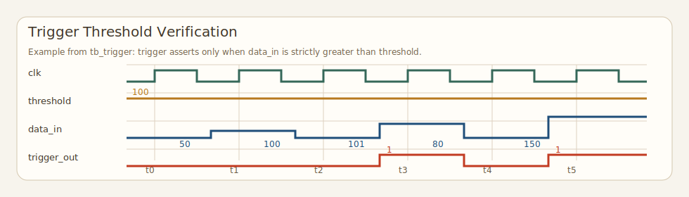
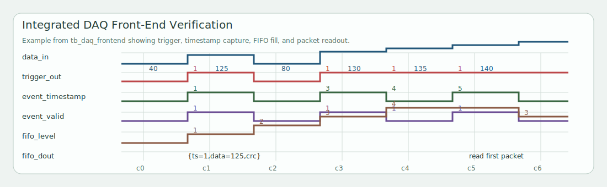

# FPGA Low-Latency DAQ Front-End

A self-contained Verilog simulation of a detector-style front-end data acquisition chain. The design performs low-latency threshold triggering, tags trigger events with clock timestamps, buffers event packets in a FIFO, and appends a CRC byte so downstream logic can detect corruption.

The project is intentionally compact enough to review quickly, but structured to reflect the same trigger, buffering, and integrity-check concepts used in real instrumentation pipelines.

## What It Demonstrates

- Real-time threshold trigger generation
- Cycle-accurate timestamp tagging of trigger events
- FIFO buffering with full and empty protection
- CRC generation and corruption detection
- Integrated top-level verification with self-checking testbenches

## Architecture

| Module | Role |
| --- | --- |
| `rtl/trigger.v` | Synchronous threshold comparator for `data_in > threshold` |
| `rtl/timestamp_counter.v` | Free-running event clock counter |
| `rtl/fifo.v` | Synchronous circular FIFO with occupancy tracking |
| `rtl/crc8.v` | CRC-8 generator for tagged event packets |
| `rtl/daq_frontend.v` | Top-level integration of trigger, timestamp, CRC, and FIFO |

### Data Path

```text
data_in --> trigger compare --> event detected --> {timestamp, data, crc} --> FIFO
                     ^
                     |
               threshold register
```

Integrated event packet format:

```text
{ timestamp[31:0], data[15:0], crc[7:0] }
```

## Repository Layout

```text
rtl/   synthesizable Verilog modules
tb/    self-checking testbenches
sim/   one-command simulation runner and generated build/wave directories
docs/  waveform assets and architecture notes
```

## Verification Coverage

Each RTL block has a dedicated testbench:

| Testbench | Checks |
| --- | --- |
| `tb/tb_trigger.v` | Trigger asserts only when `data_in > threshold` |
| `tb/tb_timestamp.v` | Counter reset, increment, and hold behavior |
| `tb/tb_fifo.v` | FIFO ordering, occupancy, full, empty, blocked write/read |
| `tb/tb_crc8.v` | CRC generation and injected error detection |
| `tb/tb_daq_frontend.v` | End-to-end packet tagging, FIFO integration, backpressure, CRC mismatch on corruption |

## How To Run

Prerequisites:

- `iverilog`
- `vvp`
- `surfer`

Run the full regression:

```bash
make test
```

Or:

```bash
./sim/run_all.sh
```

Generated waveforms are written to `sim/waves/`.

Open waveforms in Surfer with the repo helper:

```bash
make view TB=tb_trigger
make view TB=tb_daq_frontend
```

Or directly:

```bash
./sim/surfer/open_wave.sh tb_trigger
./sim/surfer/open_wave.sh tb_daq_frontend
```

Detailed Surfer usage is documented in `docs/surfer.md`.

## Results Summary

Current regression status:

```text
TB_TRIGGER PASS
TB_TIMESTAMP PASS
TB_FIFO PASS
TB_CRC8 PASS
TB_DAQ_FRONTEND PASS
```

## Waveform Examples

Trigger threshold crossing:



Integrated DAQ packet capture:



The current images are illustrative placeholders. The simulation flow emits real VCDs in `sim/waves/`, and the repository is set up to inspect those traces with Surfer.

## Context

This repository is a conceptual miniature of a front-end trigger and readout chain: compare detector-like samples against a threshold, timestamp interesting events, buffer them safely, and protect event payloads with an integrity check. That is the same systems pattern used in much larger real-world instrumentation stacks, scaled down here into a clean and reviewable FPGA simulation project.
